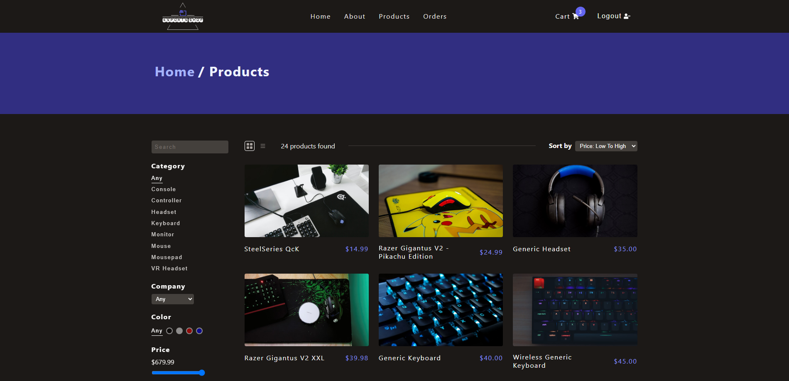

# Ecommerce Esports Website

- Demo of completed project: https://youtu.be/qb_d843aLsU
- REST API Docs: https://documenter.getpostman.com/view/20219898/2s93sc5Czj

# Setup

Add mock products

1. Create a `products` collection in MongoDB Atlas
2. Click Insert Document -> Click `{}`
3. Copy and paste the JSON text from /test/mock-products.json

Start the server

1. Navigate into /server
2. Create a .env file and set: MONGO_URL, DB_NAME, JWT_SECRET, JWT_LIFETIME, STRIPE_SECRET_KEY
3. Run `npm install`
4. Run `npm start`

Start the client

1. Navigate into /client
2. Create a .env file and set: REACT_APP_STRIPE_PUBLIC_KEY
3. Run `npm install`
4. Run `npm start`

Run script to automate registering users and making reviews

1. Navigate into /test
2. Run `npm install`
3. Run `node test.js`

## For testing checkout and payment

Use Stripe's test cards: https://stripe.com/docs/testing
